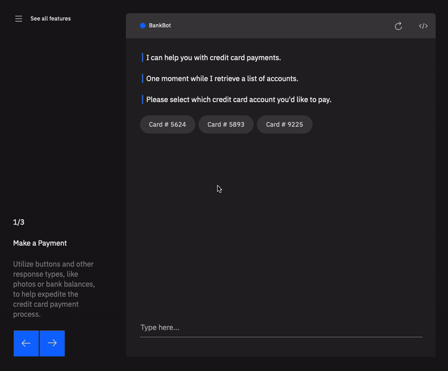
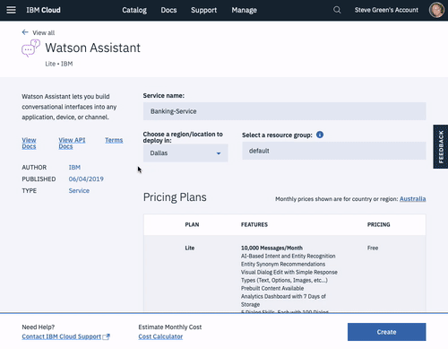

<h1 align="center" style="border-bottom: none;">🚀 Watson Assistant Duo Demo</h1>

[](https://travis-ci.org/watson-developer-cloud/assistant-demo)

### In this sample application, you're engaging with a banking virtual assistant. The assistant simulates a few scenarios, such as making a credit card payment, booking an appointment with a banker and choosing a credit card. Watson can understand your entries and respond accordingly.

This app demonstrates the Watson Assistant service via a complete, complex interface which engages in simulated banking tasks. It utilises features such as:

- Cloud Functions
- Actions and UI Actions
- Slots
- Multi-Conditional Responses
- Multi-Modal Responses

[](https://watson-assistant-demo.ng.bluemix.net)

## Prerequisites

1. Sign up for an [IBM Cloud account](https://cloud.ibm.com/registration).
1. Download the [IBM Cloud CLI](https://cloud.ibm.com/docs/cli/index.html#overview).
1. Create an instance of the Watson Assistant service and get your credentials:
   - Go to the [Watson Assistant][service_url] page in the IBM Cloud Catalog.
   - Log in to your IBM Cloud account.
   - Click **Create**.
   - Click **Show** to view the service credentials.
   - Copy the `apikey` value.
   - Copy the `url` value.

## Configuring the application

1. In your IBM Cloud console, open the Watson Assistant service instance

1. Click the **Import workspace** icon in the Watson Assistant service tool. Specify the location of the workspace JSON file in your local copy of the app project:

   `<project_root>/training/banking_workspace.json`

1. Select **Everything (Intents, Entities, and Dialog)** and then click **Import**. The car dashboard workspace is created.

1. Click the menu icon in the upper-right corner of the workspace tile, and then select **View details**.

1. Click the  icon to copy the workspace ID to the clipboard.

   

1. In the application folder, copy the _.env.example_ file and create a file called _.env_

   ```
   cp .env.example .env
   ```

1. Open the _.env_ file and add the service credentials that you obtained in the previous step.

   Example _.env_ file that configures the `apikey` and `url` for a Watson Assistant service instance hosted in the US East region:

   ```
   ASSISTANT_IAM_APIKEY=X4rbi8vwZmKpXfowaS3GAsA7vdy17Qh7km5D6EzKLHL2
   ASSISTANT_URL=https://gateway-wdc.watsonplatform.net/assistant/api
   ```

1. Add the `ASSISTANT_ID` to the previous properties

   ```
   ASSISTANT_ID=522be-7b41-ab44-dec3-g1eab2ha73c6
   ```

## Running locally

1. Install the dependencies

   ```
   npm install
   ```

1. Run the application

   ```
   npm start
   ```

1. View the application in a browser at `localhost:3000`

## Deploying to IBM Cloud as a Cloud Foundry Application

1. Login to IBM Cloud with the [IBM Cloud CLI](https://cloud.ibm.com/docs/cli?topic=cloud-cli-ibmcloud-cli#overview)

   ```
   ibmcloud login
   ```

1. Target a Cloud Foundry organization and space.

   ```
   ibmcloud target --cf
   ```

1. Edit the _manifest.yml_ file. Change the **name** field to something unique.  
   For example, `- name: my-app-name`.
1. Deploy the application

   ```
   ibmcloud app push
   ```

1. View the application online at the app URL.  
   For example: https://my-app-name.mybluemix.net

## License

This sample code is licensed under Apache 2.0.  
Full license text is available in [LICENSE](LICENSE).

## Contributing

See [CONTRIBUTING](CONTRIBUTING.md).

## Open Source @ IBM

Find more open source projects on the
[IBM Github Page](http://ibm.github.io/).

[service_url]: https://www.ibm.com/cloud/watson-assistant/
[docs]: https://cloud.ibm.com/docs/services/assistant/index.html#about
[demo_url]: http://assistant-demo.ng.bluemix.net/
[doc_intents]: (https://cloud.ibm.com/docs/services/assistant?topic=assistant-intents#intents)
[docs_landing]: (https://cloud.ibm.com/docs/services/assistant?topic=assistant-getting-started#getting-started)
